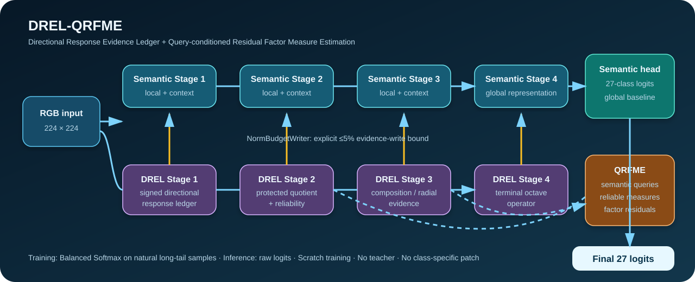

<div align="center">


[**English**](README.md) | [**简体中文**](README_zh-CN.md) | [DREL-QRFME 方法](docs/drel_qrfme_full_release_zh-CN.md) | [复现指南](docs/data_and_reproduction_zh-CN.md) | [实验证据](results/drel_qrfme_epoch097/metrics_summary.json)

[](pyproject.toml)
[](environment-faf-paper.yml)
[](https://github.com/drxadqz/RoadAffordanceLab/actions/workflows/repository-quality.yml)
[](LICENSE)

**DREL-QRFME：面向 RSCD 27 类路面状态识别的有界方向响应证据与查询条件因子测度网络。**

</div>

## 完整 RSCD 正式结果

DREL-QRFME 在全部 **958,941** 张训练图像上从零训练。公开的 Epoch 97 checkpoint 只根据 **19,860 张验证图像**选取，随后在与训练/验证均无文件名重叠的 **49,500 张官方测试图像**上完成一次正式测试。

| 模型 | 测试协议 | Top-1 | Macro-F1 | Bottom-5 F1 | 最差类别 F1 | 参数量 |
|---|---|---:|---:|---:|---:|---:|
| **DREL-QRFME（本文）** | RSPNet 公开代码 direct resize 224 | **92.265%** | **90.061%** | **79.359%** | **75.508%** | 26.15M |
| RSPNet-L（公开实现、本机复测） | RSPNet 公开代码 direct resize 224 | 92.034% | 89.474% | 77.670% | 72.814% | 3.69M |
| **差值（本文 − RSPNet-L）** | 同机器、同预处理 | **+0.230 pp** | **+0.587 pp** | **+1.689 pp** | **+2.693 pp** | — |

DREL-QRFME 使用单模型、单裁剪、原始 logits，不使用模型集成和 TTA；最差类别为 `water_concrete_slight`。另一套冻结预处理“短边缩放 1.14 后中心裁剪 224”得到 **92.057% Top-1**、**89.819% Macro-F1**、**79.055% Bottom-5 F1** 和 **75.587% 最差类别 F1**。

> 结论边界：direct-resize 结果是对同一个冻结 checkpoint 做的事后同协议比较，不是根据测试集挑选变换。它超过了本机同协议复测的 RSPNet-L，但目前仍是单种子结果；在完成多种子验证之前，不把它表述为已经具有统计显著性的 SOTA。

训练曲线、逐类别指标、混淆矩阵、协议文件和哈希位于 [`results/drel_qrfme_epoch097`](results/drel_qrfme_epoch097)。公开模型在 **Epoch 97** 达到最优，共 **26,145,426** 个参数；checkpoint SHA-256 为 `72c2c2cd34545dcc1e22d5c89d43d1c79b3278a3edd7bc5857e0ab0a493dff55`。

## 算法架构



DREL-QRFME 围绕一个清晰问题设计：如何让脆弱但重要的路面纹理证据修正稳定语义表征，同时不压过主干？

1. **路面语义流**：四阶段局部 3×3 与中尺度 7×7 深度卷积上下文共同表达材质与整体外观；
2. **方向响应证据账本（DREL）**：保留带符号的方向纹理与边缘响应，并通过受保护商分解将响应组成和能量/可靠性分开；
3. **有界证据写入**：`NormBudgetWriter` 在逐阶段显式范数预算下写回证据，最大写入比例不超过 5%；
4. **查询条件 RFME**：语义因子查询与局部可靠性共同形成归一化空间测度，在 condition/material/roughness 三个轴上估计条件残差，再通过有界门控修正 27 类语义 logits。

Balanced Softmax 只在训练损失内部修正长尾类别先验，验证和推理始终使用模型原始 logits。模型拒绝预训练权重，不使用教师模型、手工类别修正、TTA 或集成。

完整公式、张量形状、不变量和代码对应关系见 [DREL-QRFME 完整说明](docs/drel_qrfme_full_release_zh-CN.md)与 [English version](docs/drel_qrfme_full_release.md)。

## 快速开始

```bash
git clone https://github.com/drxadqz/RoadAffordanceLab.git
cd RoadAffordanceLab
git lfs install && git lfs pull
pip install -r requirements.txt
pip install -e .
```

按照方法文档准备数据 manifest 和路径映射后，使用冻结配置训练：

```bash
python train_drel_qrfme.py \
  --dataset-root /path/to/RSCD \
  --config configs/drel_qrfme/rscd_full_train_seed097.yaml \
  --output-dir runs/drel_qrfme_seed097
```

在验证集上复核公开 checkpoint：

```bash
python evaluate_drel_qrfme.py \
  --dataset-root /path/to/RSCD \
  --config configs/drel_qrfme/rscd_full_train_seed097.yaml \
  --checkpoint checkpoints/drel_qrfme_epoch097/best_checkpoint.pth \
  --output-dir runs/eval_epoch097
```

默认评估入口有意只读取验证集。官方测试与开发过程隔离，仓库发布不可变测试证据，而不是在调参过程中反复读取测试集。

## 仓库结构

```text
src/drel_qrfme/                 模型、方向算子、损失、数据与训练引擎
configs/drel_qrfme/             冻结模型定义和完整 RSCD 训练配置
checkpoints/drel_qrfme_epoch097 最佳 checkpoint 与 SHA-256
results/drel_qrfme_epoch097/    训练、验证、测试、逐类指标和协议证据
docs/drel_qrfme_full_release*   理论—代码一致的中英文说明
train_drel_qrfme.py             稳定训练入口
evaluate_drel_qrfme.py          默认不读取测试集的评估入口
```

早期 C3-FaRNet-S7 全量测试材料和 DREL-E B 验证研究继续保留，用于展示研究谱系，但不再作为本仓库的首页主结果。

## 可复现性与完整性

- Seed 97，完整训练 100 轮，Epoch 97 最优；
- AdamW，BF16 训练、FP32 评估；
- 自然全量采样 + Balanced Softmax，不使用预训练；
- checkpoint、指标、预测和测试协议均带哈希；
- 训练、验证、测试严格分离，checkpoint 选择不读取测试标签。

```bash
python scripts/check_repository_contract.py
python -m compileall -q src train_drel_qrfme.py evaluate_drel_qrfme.py
pytest -q tests/test_drel_qrfme_full.py
```

## 文档

| 内容 | English | 中文 |
|---|---|---|
| DREL-QRFME 理论、架构与证据 | [Full release](docs/drel_qrfme_full_release.md) | [完整说明](docs/drel_qrfme_full_release_zh-CN.md) |
| 数据与复现 | [Guide](docs/data_and_reproduction.md) | [指南](docs/data_and_reproduction_zh-CN.md) |
| 早期 C3-FaRNet 证据 | [Result](docs/results_current_best.md) | [结果](docs/results_current_best_zh-CN.md) |
| DREL-E B 验证研究 | [Method](docs/drel_algorithm.md) | [方法](docs/drel_algorithm_zh-CN.md) |

## 引用与许可

若本仓库对你的研究有帮助，请引用项目地址和 RSCD 数据集原论文。论文方法冻结后将补充正式 BibTeX。代码采用 [MIT License](LICENSE)，RSCD 图像仍受原数据集许可约束。
