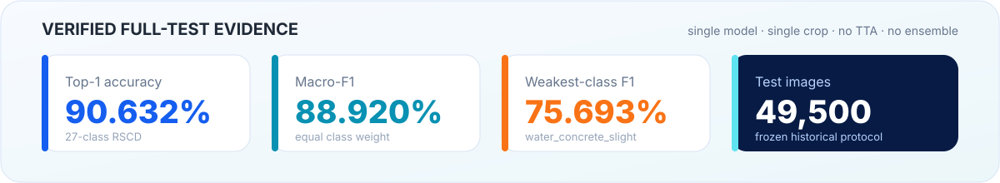
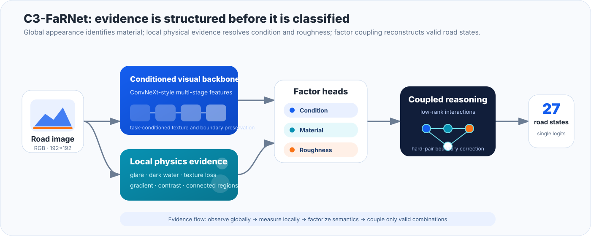

<div align="center">


[**English**](README.md) | [**简体中文**](README_zh-CN.md) | [架构详解](docs/algorithm_zh.md) | [DREL](docs/drel_algorithm_zh-CN.md) | [复现指南](docs/data_and_reproduction_zh-CN.md) | [实验证据](docs/results_current_best_zh-CN.md)

[](pyproject.toml)
[](environment-faf-paper.yml)
[](https://github.com/drxadqz/RoadAffordanceLab/actions/workflows/repository-quality.yml)
[](LICENSE)
[](docs/data_and_reproduction_zh-CN.md)

**面向复杂路面状态识别的因子感知、物理引导模型，以及可审计的 PyTorch 训练与评估工程。**

</div>

## 为什么要做这个项目

路面识别不是普通的物体分类。路面材质通常依赖整体外观，而干湿程度和粗糙度往往取决于微弱的局部纹理、反光、暗水区域以及被水膜削弱的细节。因此，RSCD 的 27 个标签不应该被当成 27 个互不相关的类别名：

```text
water_concrete_slight = 积水状态 + 混凝土材质 + 轻微粗糙
```

**C3-FaRNet**（Coupled Conditioned Friction-Affordance Road Network）同时学习路面状态、材质和粗糙度证据，并显式建模它们的两两及高阶耦合。仓库公开了已经完成全量测试的 S7 模型、checkpoint 谱系、配置驱动的训练与评估代码、逐类别证据，以及原训练电脑的恢复材料。

> 科学边界：本项目研究的是基于图像的**视觉路面摩擦可供性估计**。RSCD 标签是视觉代理标签，并不是与图像同步采集的轮胎力或摩擦系数实测值。

## 已验证结果



下表来自公开的、自包含的 S7 checkpoint，在历史 RSCD 49,500 张测试图像协议上的结果。它不是 ARCQ 小型开发子集成绩，也没有使用模型集成或测试时增强。

| 模型 | 数据协议 | Top-1 | Macro-F1 | 最弱类别 F1 | 参数量 |
|---|---|---:|---:|---:|---:|
| **C3-FaRNet-S7** | 958,941 训练 / 19,860 验证 / 49,500 测试 | **90.632%** | **88.920%** | **75.693%** | 总计 32.49M / 可训练 1.09M |

- 27 个耦合的 RSCD 路面状态；
- 单模型、单裁剪；
- 不使用 TTA，不使用集成；
- 最弱类别为 `water_concrete_slight`；
- 逐类别指标、混淆矩阵和困难类别对结果位于 [`results/current_best_s7`](results/current_best_s7)。

结果的严格适用边界见[当前验证结果](docs/results_current_best_zh-CN.md)，checkpoint 继承关系见 [S7 training lineage](docs/s7_training_lineage.md)。

## 架构总览



模型由四个关键思想组成：

1. **条件化视觉主干**：在最终分类器之前保留与路面任务相关的纹理和类别边界证据；
2. **局部物理证据**：提取反光、暗水、纹理擦除、梯度和局部对比度等可微线索；
3. **因子化预测**：分别判断路面状态、材质和粗糙度，而不是死记 27 个不透明类别名；
4. **耦合决策层**：建模因子之间的相互作用，重点处理 wet/water、slight/severe 等只相差一个因子的困难边界。

完整前向路径、公式和代码对应关系见[中文算法与架构说明](docs/algorithm_zh.md)。

## 30 秒了解仓库

```text
configs/                     可复现的实验配置
checkpoints/                 通过 Git LFS 发布的 checkpoint
src/friction_affordance/     模型、损失、数据、指标与训练引擎
results/current_best_s7/     机器可读的正式测试证据
results/s7_lineage/          checkpoint 与实验谱系
recovery/                    历史源码、manifest 和环境记录
docs/                        方法、证据与复现文档
train.py / validate.py / test.py
                             稳定的命令行入口
```

这个结构既服务于科研复现，也用于展示模型工程能力：每个公开结论都能追溯到配置、checkpoint、指标文件、数据协议和环境记录，而不是只展示一张成绩截图。

## 快速开始

### 1. 安装

```bash
git clone https://github.com/drxadqz/RoadAffordanceLab.git
cd RoadAffordanceLab
git lfs install
git lfs pull

conda env create -f environment-faf-paper.yml
conda activate faf_paper
pip install -e .
```

也可以使用精简 pip 安装：

```bash
pip install -r requirements.txt
pip install -e .
```

### 2. 准备数据 manifest

复制本地路径模板，并指向你下载的 RSCD 数据：

```bash
cp configs/data/local_paths.example.yaml configs/data/local_paths.yaml
python scripts/build_manifests.py \
  --config configs/data/local_paths.yaml \
  --out-dir data/manifests_full
```

字段格式和数据划分契约见[数据与复现指南](docs/data_and_reproduction_zh-CN.md)。本仓库不重新分发 RSCD 原始图片。

### 3. 评估已发布的 S7 checkpoint

```bash
python test.py \
  --config configs/c3_farnet/current_best_s7_public.yaml \
  --checkpoint checkpoints/c3_farnet_formal_fullmanifest_source_reliable_router_s7_20260709/best_checkpoint.pth \
  --output-dir outputs/reproduce_s7
```

### 4. 使用公开配置训练

```bash
python train.py --config configs/c3_farnet/current_best_s7_public.yaml
```

已验证 S7 属于 warm-start 实验。请先拉取 Git-LFS 文件，并在解释复现结果前阅读[母模型训练说明](docs/parent_model_training.md)。

## 工程能力展示

| 能力 | 仓库中的实现 |
|---|---|
| 配置驱动实验 | 使用 YAML 定义数据、架构、损失、优化器和评估 |
| 严格评估 | Top-1、Macro-F1、逐类别 F1、困难类别对和混淆矩阵 |
| 产物谱系 | checkpoint manifest、历史环境、run history 和恢复说明 |
| GPU 训练 | PyTorch 混合精度、梯度累积、CUDA 环境记录 |
| 模块化建模 | 主干注册、因子头、物理分支、耦合分类头与可扩展损失 |
| 发布安全 | 仓库契约检查、本机私有路径检查、文档链接检查和 CI |

这些能力同样适用于更大规模的模型系统：受控实验、确定的接口、超越单一平均分的评估、产物血缘以及可复现的 GPU 环境。

## 研究状态

- **已经发布**：C3-FaRNet-S7 及其全量测试证据；
- **已经恢复**：历史 manifest、源码快照、环境记录和仍可获得的 checkpoint 链；
- **以 validation-only 研究代码发布**：干净的 DREL-E B `component_full` 生产候选、冻结 D350 规格、测试、机器可读三种子验证证据和完整双语解释；
- **正在研究**：针对 roughness 的 DREL 后续单变量路线。没有通过冻结门槛的实验不会提前合入生产模型。

这种分离是有意为之：好看的图有展示价值，但只有冻结后的证据才应该成为公开性能结论。

### DREL 生产候选（仅 D350 validation）

新发布的 [`DREL-E B component_full`](docs/drel_algorithm_zh-CN.md) 是一个约 276 万参数的从零训练分类器。它包含单向方向/径向证据账本、矩保持过渡、区域均值/偏离块、受约束匹配响应滤波器，以及 `0.25 × tanh` 有界证据写入。

在相同 Gate8 D350 validation 预算下，DREL 的三种子均值在九个冻结指标中的八个高于单种子 RSPNet-M/L envelope。唯一例外是 roughness：`0.586420` 对 `0.608889`，低 2.247 个百分点。该结果是 validation screen，不是历史 49,500 张正式 test 结论，也不会替换上方 S7 正式成绩表。

```python
import torch
from friction_affordance.models.drel import build_drel_component_full

model = build_drel_component_full(num_classes=27, head_init_seed=970027)
logits = model(torch.randn(2, 3, 360, 240))
```

请阅读[DREL 完整算法说明](docs/drel_algorithm_zh-CN.md)和[严格结论边界下的验证证据](docs/drel_validation_evidence_zh-CN.md)。

## 文档导航

| 内容 | English | 中文 |
|---|---|---|
| 方法与架构 | [Architecture](docs/algorithm.md) | [算法与架构](docs/algorithm_zh.md) |
| 数据与复现 | [Reproducibility](docs/data_and_reproduction.md) | [数据与复现](docs/data_and_reproduction_zh-CN.md) |
| 已验证证据 | [Results](docs/results_current_best.md) | [验证结果](docs/results_current_best_zh-CN.md) |
| DREL 生产算法 | [DREL guide](docs/drel_algorithm.md) | [DREL 完整说明](docs/drel_algorithm_zh-CN.md) |
| DREL 验证证据 | [DREL evidence](docs/drel_validation_evidence.md) | [DREL 验证证据](docs/drel_validation_evidence_zh-CN.md) |
| Checkpoint 谱系 | [Training lineage](docs/s7_training_lineage.md) | — |
| 发布清单 | [Inventory](docs/s7_release_inventory.md) | — |
| 恢复边界 | [Recovery status](recovery/RECOVERY_STATUS.md) | — |

## 仓库完整性检查

运行与 CI 相同的轻量检查：

```bash
python scripts/check_repository_contract.py
python -m compileall -q src scripts/check_repository_contract.py
```

该检查会验证双语入口、关键公开产物、本地 Markdown 链接，以及面向公开展示的文件中是否意外出现本机绝对路径。

## 引用

如果本项目对你的工作有帮助，请引用仓库地址以及 RSCD 数据协议对应论文。ARCQ 方法与最终实验协议冻结后，仓库会增加论文专用 BibTeX。

## 许可证

代码采用 [MIT License](LICENSE)。数据集图片仍受 RSCD 原始许可条款约束。
