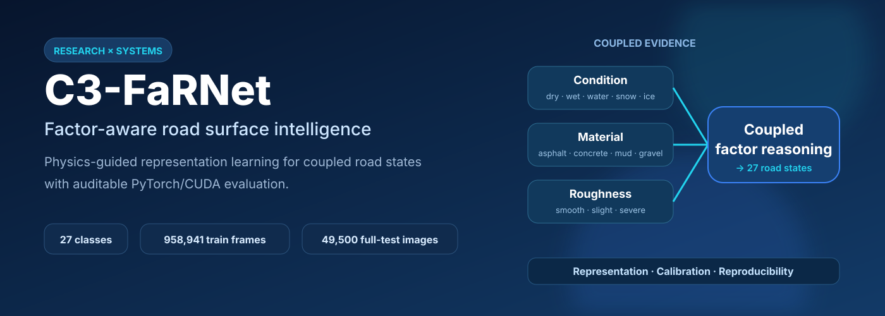
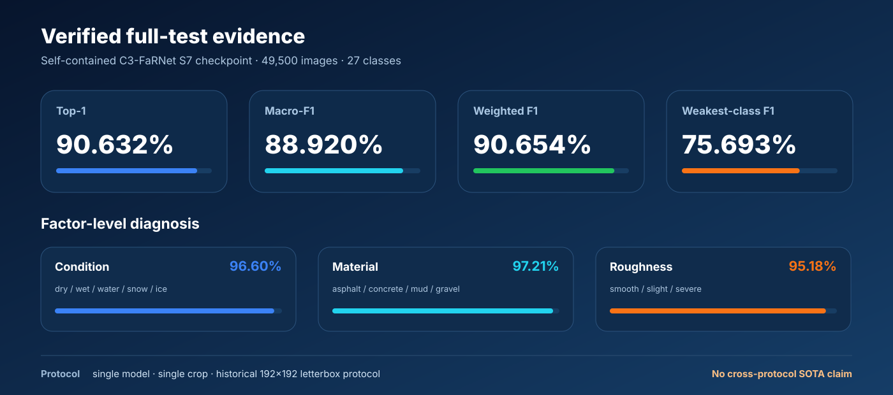
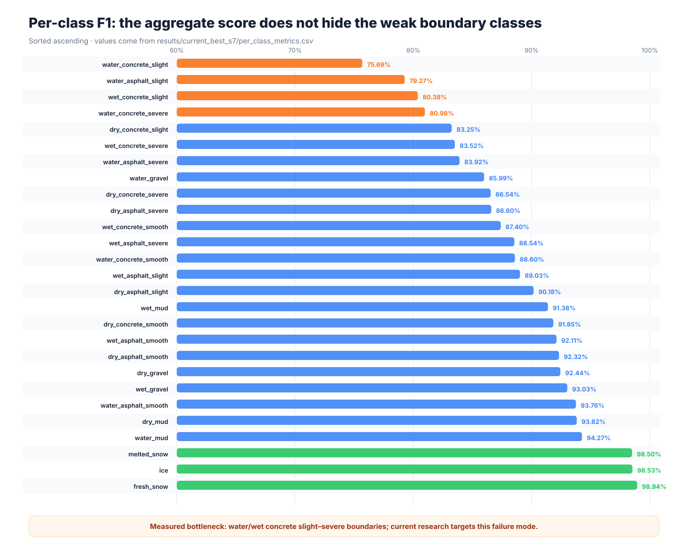
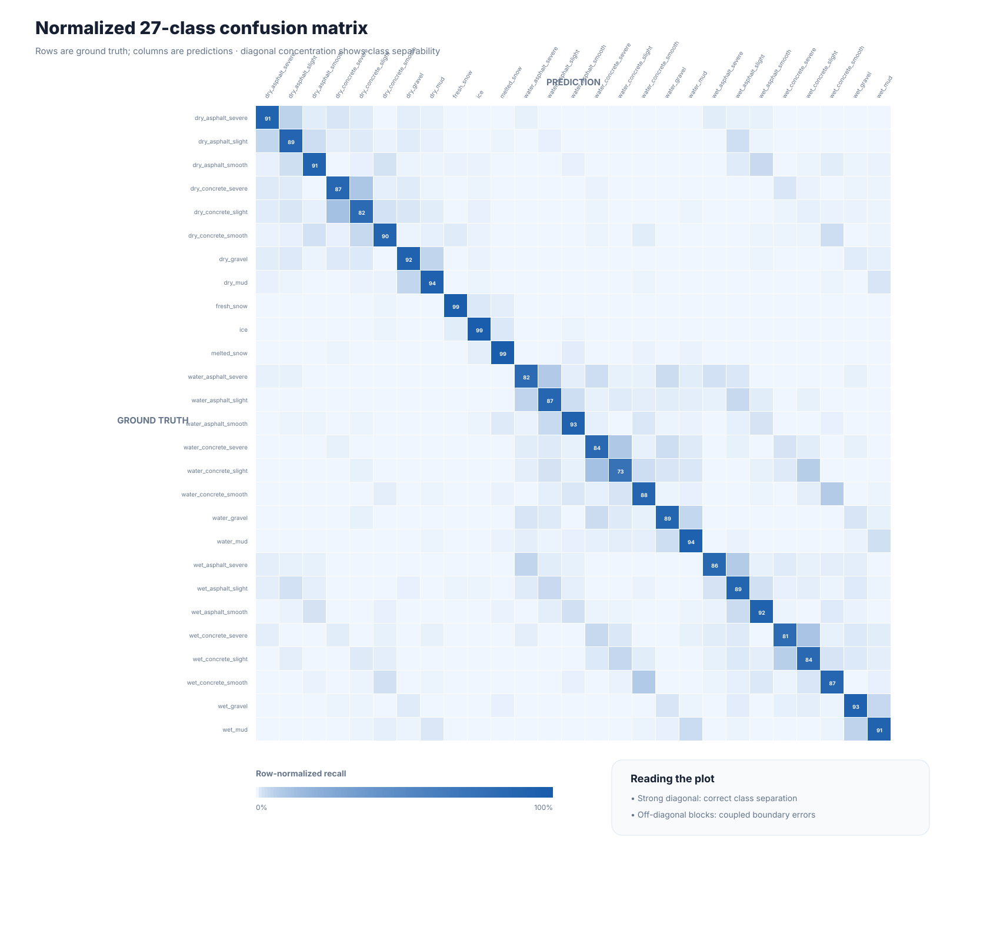
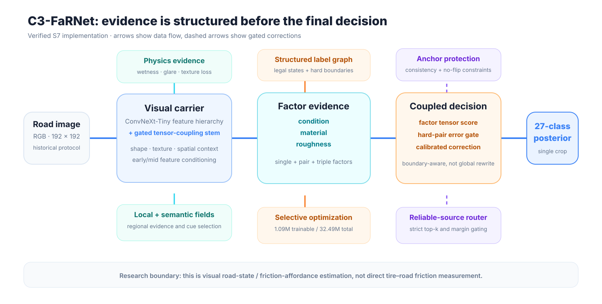

<p align="center">
  
</p>

<p align="center">
  <a href="https://github.com/drxadqz/rp/actions/workflows/public-release-check.yml"></a>
  
  
  <a href="LICENSE"></a>
</p>

<p align="center">
  <a href="README.md">English</a> · <b>简体中文</b> ·
  <a href="#快速开始">快速开始</a> ·
  <a href="docs/algorithm_zh.md">算法详解</a> ·
  <a href="docs/results_current_best.md">实验结果</a> ·
  <a href="docs/engineering_case_study.md">工程案例</a>
</p>

## 项目简介

**C3-FaRNet**（Coupled Conditioned Friction-Affordance Road Network）是一个面向细粒度路面状态识别的研究级 PyTorch 项目。RSCD 的 27 个类别不是 27 个互不相关的名称，而是由三类因素共同组成：

- 表面状态：dry、wet、water、snow、ice；
- 路面材质：asphalt、concrete、mud、gravel；
- 粗糙程度：smooth、slight、severe。

项目将通用视觉主干、可微物理证据、因子化标签结构、低秩耦合、困难类别校准以及完整的 CUDA 实验审计链整合在同一套系统中。首页展示的所有指标都来自仓库中已经冻结的 S7 checkpoint 和 49,500 张完整测试集结果，不把尚未通过公平对比的实验路线写成 SOTA。

## 已核验结果

<p align="center">
  
</p>

| 模型记录 | Top-1 | Macro-F1 | Weighted F1 | 测试图片 | 正确含义 |
|---|---:|---:|---:|---:|---|
| **C3-FaRNet S7 独立 checkpoint** | **90.6323%** | **88.9197%** | **90.6539%** | 49,500 | 主要可报告结果 |
| 母模型 checkpoint + 可靠源路由 | 90.6404% | 88.9410% | — | 49,500 | 推理变体，不是单独训练的 checkpoint |

最弱类别为 `water_concrete_slight`，F1 为 75.6931%。完整的逐类指标、混淆矩阵、逐图预测、解析后配置、日志与 checkpoint SHA256 均保存在 [`results/`](results/) 中，并由 [`docs/s7_release_inventory.md`](docs/s7_release_inventory.md) 给出索引。

> **结论边界：**这些数字属于历史 RSCD 192×192 letterbox 协议，不能跨协议直接声称 SOTA。模型预测的是视觉路面状态与摩擦可供性，不是通过轮胎力传感器同步测得的真实摩擦系数。

<details>
<summary><b>展开查看 27 类 F1</b></summary>

<p align="center">
  
</p>

</details>

<details>
<summary><b>展开查看归一化混淆矩阵</b></summary>

<p align="center">
  
</p>

</details>

## 为什么不能只做普通 27 类分类？

例如 `water_concrete_slight` 可以写成：

$$
y=(f,m,r),
$$

其中 $f$ 表示表面状态，$m$ 表示材质，$r$ 表示粗糙度。湿润混凝土的轻微粗糙外观，不等于“湿润特征 + 混凝土特征 + 轻微粗糙特征”的简单相加。因此 C3-FaRNet 同时建模单因素、两两耦合和三因素联合项：

$$
Z(f,m,r)=A_f+B_m+C_r+D_{fm}+E_{fr}+G_{mr}+H_{fmr}.
$$

模型还保留颜色、高光、暗水、局部梯度、纹理擦除、雪冰亮度和区域连通性等可微证据。困难类别修正只在经过定义的相邻边界附近启用，不允许一个后处理模块任意重写全部类别。

<p align="center">
  
</p>

算法细节见 [`docs/algorithm_zh.md`](docs/algorithm_zh.md)。

## 项目体现的能力

| 方向 | 仓库中的实际证据 |
|---|---|
| **表征学习** | 条件化视觉层次、全局/局部物理场、结构化因子嵌入、低秩张量耦合 |
| **模型评估** | Top-1、Macro-F1、因素准确率、困难对准确率、逐类 F1、混淆矩阵、错误归因 |
| **训练工程** | 混合精度、梯度累积、选择性参数训练、可恢复 checkpoint、manifest 数据管线 |
| **可复现性** | 解析后配置、checkpoint 哈希、Git LFS 权重、历史环境、manifest 与发布清单 |
| **研究规范** | 明确结论边界、负结果门控、冻结评估协议、主动公开最弱类别 |
| **可解释性** | 物理证据摘要、因素级混淆分析、局部证据场、特征图与失败样本审计 |

这些能力可以直接迁移到多模态与大模型研究工程：提出可证伪的表征假设、用 PyTorch 实现、设计公平评测、分析模型中间状态、管理大规模实验并保留可审计证据。项目本身是视觉任务，因此不会虚构成一个 LLM 项目。

## 快速开始

### 1. 克隆项目与下载 checkpoint

```bash
git clone https://github.com/drxadqz/rp.git
cd rp
git lfs pull
```

S7、直接母模型和冻结教师 checkpoint 通过 Git LFS 管理；RSCD 原始图片不在仓库中分发。

### 2. 安装环境

```bash
conda env create -f environment-faf-paper.yml
conda activate faf_paper
pip install -e .
```

或使用 pip：

```bash
pip install -r requirements.txt
pip install -e .
```

### 3. 生成本机 manifest

```bash
cp configs/data/local_paths.example.yaml configs/data/local_paths.yaml
# 修改 local_paths.yaml 后执行：
python scripts/build_manifests.py \
  --config configs/data/local_paths.yaml \
  --out-dir data/manifests_full
```

### 4. 评估已冻结 S7 checkpoint

```bash
python test.py \
  --config configs/c3_farnet/current_best_s7_public.yaml \
  --checkpoint checkpoints/c3_farnet_formal_fullmanifest_source_reliable_router_s7_20260709/best_checkpoint.pth
```

### 5. 运行历史续训配方

```bash
python train.py --config configs/c3_farnet/current_best_s7_public.yaml
```

这是从已上传母模型和教师继续训练一个完整 epoch 的历史配方，不是从零训练。完整继承链见 [`docs/s7_training_lineage.md`](docs/s7_training_lineage.md)。

### 6. 重建并检查公开结果图

```bash
python scripts/build_public_assets.py
python scripts/verify_public_release.py
```

## 仓库结构

```text
assets/                         由结果文件自动生成的首页图
checkpoints/                    Git LFS 管理的精选模型权重
configs/c3_farnet/              S7、母模型和推理路由配置
docs/                           算法、结果、继承链和工程案例
recovery/                       旧训练电脑的可审计恢复材料
results/current_best_s7/        49,500 张完整测试的紧凑证据
results/s7_lineage/             母模型 → S7 → 路由的详细证据
scripts/                        数据、评估、诊断与发布工具
src/friction_affordance/        模型、数据、损失、引擎与指标源码
```

`recovery/` 是历史溯源档案，不是新读者的入口。建议从本 README、[`docs/algorithm_zh.md`](docs/algorithm_zh.md) 和 [`docs/s7_release_inventory.md`](docs/s7_release_inventory.md) 开始阅读。

## 当前研究状态

- **已发布并核验：**C3-FaRNet S7 以及母模型 + 可靠源路由的推理记录。
- **已测得瓶颈：**粗糙度因素参与了 51.50% 的 S7 错误；water/wet concrete 的 slight/severe 边界最难。
- **正在研究：**完全自研的 ARCQ/TACT 路面主干及与公开基线的同协议对照。
- **尚未声称：**ARCQ 已超过 RSPNet、跨协议 SOTA、直接摩擦系数测量。

详细研究门控见 [`docs/research_status.md`](docs/research_status.md)。

## 许可证

代码采用 [MIT License](LICENSE)。数据集可能受原始发布方的独立许可约束，仓库不包含原始图片。
