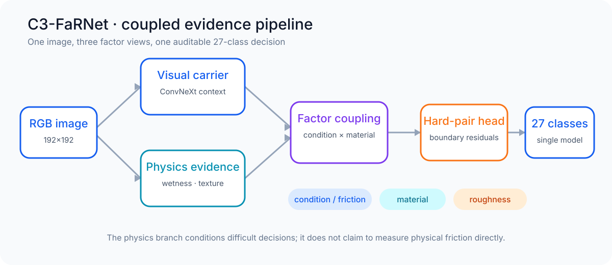
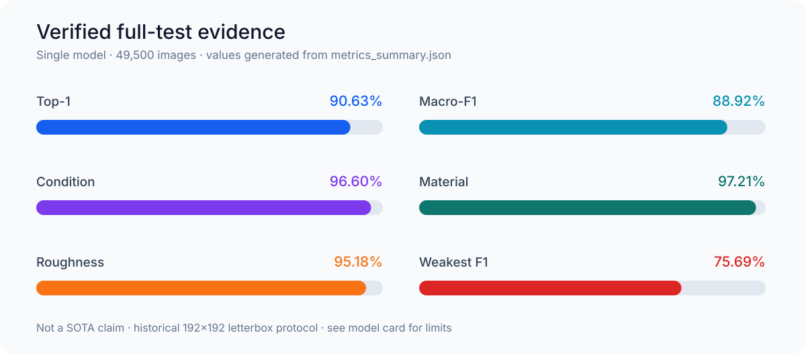
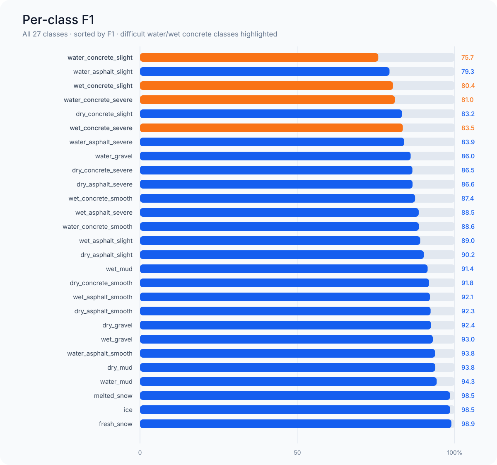

<p align="center">
  
</p>

<h1 align="center">RoadAffordanceLab</h1>

<p align="center">
  <strong>面向 RSCD 路面状态识别的因子化、物理引导、可审计 PyTorch/CUDA 研究工程项目</strong>
</p>

<p align="center">
  <a href="README.md">English</a> ·
  <a href="#60-秒看懂项目">60 秒看懂项目</a> ·
  <a href="#已核验的结果">已核验结果</a> ·
  <a href="#快速开始">快速开始</a> ·
  <a href="docs/engineering.md">工程实现</a> ·
  <a href="MODEL_CARD.md">Model Card</a>
</p>

<p align="center">
  <a href="https://github.com/drxadqz/rp/actions/workflows/release-contract.yml"></a>
  
  
  
  
</p>

---

RoadAffordanceLab 是一个面向 RSCD 27 类路面状态识别的完整研究工程项目。它不把 `water_concrete_slight` 当成一个没有内在结构的类别编号，而是将其解释为“状态 × 材质 × 粗糙度”的组合。

仓库不只包含模型定义，还包含配置驱动训练、CUDA 混合精度、可恢复 checkpoint、困难类对分析、因子级指标、完整结果证据和 checkpoint 溯源。这些工程方法与大模型训练和评测系统具有直接共性：明确的数据契约、可控对照实验、分组误差分析和可复核产物。

> [!IMPORTANT]
> 本页指标来自已发布的单模型 S7 checkpoint 和冻结的 49,500 张 RSCD 测试记录，不声称是新的公开 SOTA。ARCQ/TACT 研究在验证协议冻结且完成前不会混入正式结果。

### 三条命令检查公开发布

发布契约检查不需要 RSCD 原始图像或 GPU；它会核对已提交的汇总指标、逐类表、混淆矩阵、README 图表和 checkpoint 清单是否相互一致。

```bash
git clone https://github.com/drxadqz/rp.git && cd rp
git lfs install && git lfs pull
python scripts/verify_release.py --check-checkpoints
```

## 60 秒看懂项目

RSCD 的难点不只是路面“亮不亮”。水膜会同时带来暗化、高光、倒影和微纹理衰减，而 `slight/severe` 又恰恰依赖微小粗糙特征。C3-FaRNet 因此同时使用：

1. ConvNeXt 主干提取的全局视觉上下文；
2. 反光、暗水、局部梯度和粗糙度等显式物理/纹理证据；
3. 状态 × 材质 × 粗糙度的因子耦合，而不是简单背诵 27 个类别名。

<p align="center">
  
</p>

详细原理可阅读 [中文算法说明](docs/algorithm_zh.md)。

## 已核验的结果

以下是已释放 checkpoint 在冻结完整协议下的结果：单模型、单裁剪、无集成，测试集为 49,500 张图像。

| 指标 | 核验值 | 含义 |
|---|---:|---|
| Top-1 | **90.632%** | 第一预测答案正确的比例 |
| Macro-F1 | **88.920%** | 27 个类别分别计算 F1 后等权平均 |
| Weighted-F1 | **90.654%** | 按类别样本量加权的 F1 |
| 状态/摩擦因子准确率 | **96.596%** | dry/wet/water/snow/ice 判断 |
| 材质准确率 | **97.210%** | asphalt/concrete/mud/gravel 判断 |
| 粗糙度准确率 | **95.176%** | smooth/slight/severe 判断 |
| 最弱类别 F1 | **75.693%** | `water_concrete_slight` |

<p align="center">
  
</p>

<details>
<summary><strong>27 个类别的完整 F1 分布</strong></summary>

<p align="center">
  
</p>

</details>

所有图表都由 [`scripts/generate_readme_assets.py`](scripts/generate_readme_assets.py) 直接读取 [`results/current_best_s7`](results/current_best_s7) 中的 CSV/JSON 生成，不是手工填写的展示图。

### 发布产物索引

| 产物 | 用途 |
|---|---|
| [`current_best_s7_public.yaml`](configs/c3_farnet/current_best_s7_public.yaml) | 可移植的模型、数据和训练契约 |
| [`best_checkpoint.pth`](checkpoints/c3_farnet_formal_fullmanifest_source_reliable_router_s7_20260709/best_checkpoint.pth) | 通过 Git LFS 发布的 checkpoint |
| [`results/current_best_s7`](results/current_best_s7) | 汇总指标、混淆矩阵、困难类对和逐类证据 |
| [`checkpoint_manifest.json`](results/s7_lineage/checkpoint_manifest.json) | checkpoint SHA256、角色与继承链 |
| [`MODEL_CARD.md`](MODEL_CARD.md) | 适用范围、限制和结果来源 |

## 算法与工程亮点

### 1. 结构化标签空间

目标类别被建模为

$$
y=(f,m,r),
$$

其中 $f$ 是路面状态，$m$ 是材质，$r$ 是粗糙度。这使错误可以被解释为状态边界、材质边界或粗糙度边界，而不是只得到一个 27×27 的黑盒混淆矩阵。

### 2. 显式物理证据与学习特征并行

模型计算亮度、饱和度、镜面反射、暗水、梯度和 Laplacian 纹理等可解释线索。这些证据不替代学习到的视觉特征，而是与主干特征联合解释困难边界。

### 3. 因子耦合而不是普通拼接

低秩两两/三元交互综合状态、材质和粗糙度 token。困难类对专家只在模糊边界产生可审计的残差修正。

### 4. 把评测当成系统工程

每个正式结果都对应解析后配置、数据 manifest 契约、checkpoint SHA256、逐类预测、因子错误和困难类对指标。候选机制必须在数据、初始化、训练 horizon 和评测精度一致时才能晋级。

## 快速开始

### 1. 克隆代码和 Git LFS 模型产物

```bash
git clone https://github.com/drxadqz/rp.git
cd rp
git lfs install
git lfs pull
```

### 2. 创建环境

```bash
conda env create -f environment-faf-paper.yml
conda activate faf_paper
pip install -e .
```

### 3. 验证公开发布契约

这一步不需要 RSCD 原始图片：

```bash
python scripts/verify_release.py --check-checkpoints
python scripts/generate_readme_assets.py --check
```

### 4. 生成 RSCD manifest

复制 [`configs/data/local_paths.example.yaml`](configs/data/local_paths.example.yaml) 为 `configs/data/local_paths.yaml`，填写本地 RSCD 路径后执行：

```bash
python scripts/build_manifests.py \
  --config configs/data/local_paths.yaml \
  --out-dir data/manifests_full
```

### 5. 评估已发布的 S7 模型

```bash
python test.py \
  --config configs/c3_farnet/current_best_s7_public.yaml \
  --checkpoint checkpoints/c3_farnet_formal_fullmanifest_source_reliable_router_s7_20260709/best_checkpoint.pth
```

### 6. 复现选择性微调配置

```bash
python train.py --config configs/c3_farnet/current_best_s7_public.yaml
```

## 与大模型岗位相关的工程能力

| 大模型工作流 | 本项目中的对应实现 |
|---|---|
| 数据/提示契约 | 不可变 CSV manifest 和因子标签一致性审计 |
| 高效微调 | 明确 trainable-prefix 的选择性参数训练 |
| 大规模训练基础 | CUDA AMP、梯度累积、数据预取和 checkpoint 恢复 |
| 评测框架 | 全局、逐类、因子和困难边界指标 |
| 模型行为分析 | 混淆分片、最弱类诊断和反事实对照 |
| 可复现实验 | 解析配置、SHA256 产物与预注册晋级门 |
| 负责任的模型报告 | Model Card、数据边界和非 SOTA 说明 |

更多实现细节见 [工程说明](docs/engineering.md)。

## 文档索引

| 文档 | 内容 |
|---|---|
| [算法详解（中文）](docs/algorithm_zh.md) | C3-FaRNet 结构、原理与公式 |
| [Algorithm (English)](docs/algorithm.md) | 英文方法说明 |
| [Model Card](MODEL_CARD.md) | 用途、指标、限制和安全边界 |
| [数据与复现](docs/data_and_reproduction.md) | Manifest 契约和数据准备 |
| [工程说明](docs/engineering.md) | 训练/评测系统与代码阅读路径 |
| [结果证据](docs/results_current_best.md) | 已核验指标和证据文件 |
| [S7 训练谱系](docs/s7_training_lineage.md) | 母模型、teacher 与 S7 checkpoint 关系 |
| [发布清单](docs/s7_release_inventory.md) | 源码、配置、checkpoint 和 SHA |

## 科学与安全边界

本项目估计的是**视觉路面状态和视觉摩擦可供性**。RSCD 标签是视觉代理标签，不是同步轮胎力或摩擦仪测量。该模型不能被当成摩擦系数传感器，也不能作为安全关键驾驶决策的唯一依据。

## 引用与许可

引用本项目时请使用 [`CITATION.cff`](CITATION.cff)。RSCD 数据集请引用其 [IEEE T-ITS 原始论文](https://doi.org/10.1109/TITS.2023.3264588)。代码使用 [MIT License](LICENSE)；数据集和第三方资产仍遵循各自许可。
