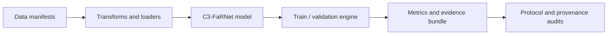

# Engineering Notes

This document is a code-reading guide to the research and evaluation stack behind RoadAffordanceLab. It focuses on the implementation patterns that make the result auditable rather than only describing the final neural network.

## System boundary

The project is split into five layers:

| Layer | Main files | Contract |
|---|---|---|
| Data | `datasets/manifest.py`, `rscd_factors.py` | Every image has a canonical 27-class label and compatible factor tuple |
| Input | `transforms.py` | Train/eval resize modes are explicit in the resolved config |
| Model | `models/c3_farnet.py`, `models/backbone.py`, `models/texture.py` | A forward pass emits 27-class logits and structured auxiliary evidence |
| Runtime | `c3_experiment.py`, `engine.py` | Optimizer, AMP, accumulation, checkpointing and evaluation follow the config |
| Evidence | `metrics.py`, `scripts/evaluate_detailed.py` | Global and sliced metrics are exported as machine-readable files |

## Code-reading path

For a technical interview or architecture review, this order gives the fastest path through the repository:

1. [`configs/c3_farnet/current_best_s7_public.yaml`](../configs/c3_farnet/current_best_s7_public.yaml) — the full experiment contract.
2. [`src/friction_affordance/models/c3_farnet.py`](../src/friction_affordance/models/c3_farnet.py) — factor tokens, coupled interactions and calibrated head.
3. [`src/friction_affordance/models/texture.py`](../src/friction_affordance/models/texture.py) — explicit image evidence.
4. [`src/friction_affordance/c3_experiment.py`](../src/friction_affordance/c3_experiment.py) — training, selective parameter updates and checkpoint lifecycle.
5. [`src/friction_affordance/metrics.py`](../src/friction_affordance/metrics.py) and [`scripts/evaluate_detailed.py`](../scripts/evaluate_detailed.py) — evaluation semantics.
6. [`results/current_best_s7`](../results/current_best_s7) — compact, inspectable result evidence.

## Configuration-driven experiments

The YAML config is the source of truth for:

- dataset manifests and input geometry;
- backbone, head and physics branches;
- checkpoint and teacher ancestry;
- trainable parameter prefixes;
- loss weights and focus classes;
- optimizer, learning rate, weight decay and horizon;
- batch size, workers, AMP and gradient accumulation;
- validation and test sample limits.

The resolved config is copied into an experiment directory. This avoids relying on undocumented command history and makes a run comparable after the code evolves.

## Selective fine-tuning

The released S7 recipe starts from a recorded parent checkpoint and updates an explicit subset of modules. Trainable parameter prefixes are listed in the config rather than hidden in optimizer code. The published model has approximately 32.49M total parameters and 1.09M trainable parameters under this recipe.

This design is analogous to parameter-efficient adaptation in foundation models: the carrier is mostly preserved while a small set of task-specific interaction and calibration parameters is optimized.

## Training runtime

The runtime supports:

- CUDA automatic mixed precision;
- gradient accumulation for limited VRAM;
- gradient clipping;
- configurable data workers and prefetch;
- deterministic seeds;
- checkpoint resume;
- initial checkpoint evaluation before any update;
- TensorBoard-compatible logging;
- selective parameter training.

The public release separates training, validation and test entry points. Test evaluation is never needed to select a model during development.

## Evaluation semantics

Top-1 alone is insufficient for RSCD because frequent or easy classes can hide a collapsed weak class. The evidence bundle therefore includes:

- Top-1, Macro-F1 and weighted F1;
- precision, recall, F1 and support for every class;
- condition/friction, material and roughness accuracies;
- hard-pair accuracies along the factor axis that differs;
- full confusion matrix;
- weakest-class and focus-class diagnostics;
- per-image predictions and confidence in the full lineage bundle.

These slices are similar to capability, domain and failure-mode slices in an LLM evaluation harness: one aggregate score is never treated as a complete behavioral description.

## Artifact provenance

The release records:

- the exact checkpoint path and role;
- expected byte size and SHA256 digest;
- direct parent and teacher checkpoints;
- resolved configuration;
- full evaluation output;
- the distinction between a standalone checkpoint result and an inference-time router result.

[`results/s7_lineage/checkpoint_manifest.json`](../results/s7_lineage/checkpoint_manifest.json) is the machine-readable checkpoint inventory. [`scripts/verify_release.py`](../scripts/verify_release.py) validates the compact metrics, confusion matrix, per-class table and LFS checkpoint contract.

## Release CI

The lightweight GitHub Actions workflow deliberately does not download the 500+ MB checkpoint chain or RSCD data. It checks the public release contract instead:

1. Python source compiles.
2. README links resolve.
3. Compact metrics and per-class files agree.
4. The confusion matrix has the expected 27-class structure and sample total.
5. Git-LFS pointer OIDs agree with the checkpoint manifest.
6. README figures are reproducible from the committed CSV/JSON evidence.

GPU correctness and full model evaluation remain local, explicit tasks because public CI does not have the dataset or target CUDA hardware.

## Research discipline

The active research workflow uses matched controls and pre-registered promotion gates. A proposed mechanism is not accepted merely because one metric moves upward. Data, seed, initialization, compute horizon and evaluation precision must match, and difficult-class or hard-pair regressions are checked separately.

Unsuccessful exploratory modules are not promoted to the README. The `recovery/` directory is an archival provenance bundle, not the recommended quick-start path.

## Known engineering debt

- Some historical implementation files are large because they preserve checkpoint-compatible class definitions.
- The exact historical training chain depends on Git-LFS checkpoints and locally obtained RSCD images.
- Full integration tests require a CUDA environment and cannot run in the lightweight public CI.
- The 192×192 letterbox protocol is part of the historical result. New native-resolution research must be reported as a separate protocol.

These limitations are stated explicitly instead of being hidden behind a single benchmark number.
